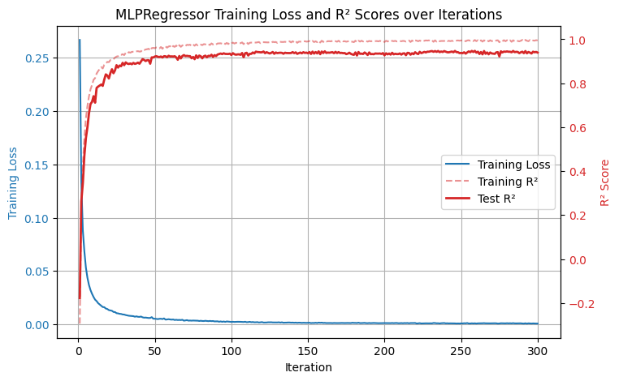
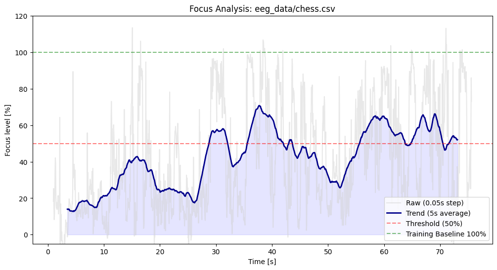
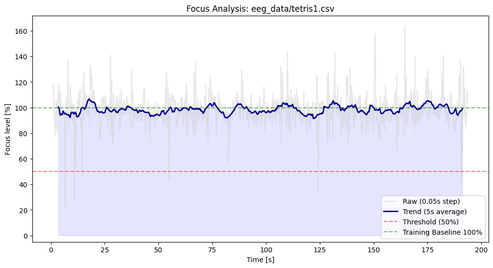

  <h1>EEG Mental Focus Tracker</h1>
  
<i>A Machine Learning Pipeline for Real-time Cognitive Workload Analysis using EEG Signals</i>

## Overview
This project provides a complete end-to-end data science pipeline for analyzing electroencephalogram (EEG) data to quantify mental effort. By leveraging signal processing techniques and a Multi-Layer Perceptron (MLP) neural network, the system can distinguish between relaxed and highly focused cognitive states. 

The trained model is then applied to continuous EEG recordings of the subject playing computationally demanding games like **Chess** and **Tetris**, allowing us to visualize the fluctuation of their focus level over time.

## Key Features
- **Signal Preprocessing**: Includes 50Hz notch filtering and 2-60Hz Butterworth bandpass filtering to remove powerline noise and movement artifacts.
- **Artifact Subspace Reconstruction (ASR)**: Integrates `mne` and `asrpy` to automatically detect and reconstruct transient high-amplitude artifacts in the EEG data.
- **Feature Extraction**: Extracts Spectral Power across key frequency bands:
  - **Theta (4–8 Hz)**: Associated with cognitive workload and memory.
  - **Alpha (8–12 Hz)**: Correlated with relaxation and visual attention.
  - **Beta (12–40 Hz)**: Linked to active concentration and problem-solving.
- **Deep Learning Model**: Utilizes Scikit-Learn's `MLPRegressor` and `MLPClassifier` to predict continuous focus levels with high accuracy.
- **Time-Series Visualization**: Applies moving-average smoothing to generate clean, interpretable trend lines of cognitive load during complex tasks.

## Tech Stack
- **Language**: Python 3.x
- **Data Processing**: `numpy`, `scipy`
- **Machine Learning**: `scikit-learn`
- **Neuroscience/EEG Tools**: `mne`, `asrpy`
- **Visualization**: `matplotlib`

## How to Run
1. Clone the repository.
2. Install the required dependencies via `pip install -r requirements.txt`.
3. Open and run all cells in `regressor_pipeline.ipynb` (or `classifier_pipeline.ipynb`).
4. The notebook will automatically load the bundled EEG dataset, generate the plots and display Focus Trend visualizations for the test games.

## Pipeline Architecture

### 1. Data Acquisition & Labeling
Raw EEG data is recorded from an 8-channel headset with electrode placement across the following nodes: FP1, FP2, T7, T8, O1, O2, FC1, FC2.
- Task Design:
  - Baseline/Rest: The subject looked at a colorful static image for five 1-minute intervals. This resting state is labeled as 0 inside the `relax.csv` files.
  - Cognitive Load: The subject solved mental arithmetic (addition and subtraction of 3-digit numbers) to induce high mental effort across five 1-minute intervals. This active state is labeled as 1 inside the `focus.csv` files.
- Recording Conditions: All trials were recorded in a single continuous sitting to maintain consistent electrode impedance and sensor placement.

### 2. Preprocessing & Artifact Removal
Raw EEG signals are inherently noisy. The following steps are applied:
1. **Notch Filter**: Scipy's `iirnotch` targets and eliminates 50Hz electrical interference.
2. **Bandpass Filter**: A 4th-order Butterworth filter isolates the 2–60Hz frequency range, discarding low-frequency drift and high-frequency muscle artifacts.
3. **ASR Calibration**: The `asrpy` library cleans the continuous data, ensuring robust feature extraction.

### 3. Feature Extraction
Sliding windows of size 1 second (500 samples at 500Hz) with an overlap are processed. For each window, the Fast Fourier Transform (FFT) is computed. The power of Theta, Alpha, and Beta frequency bands is extracted and flattened into a feature vector per window.

### 4. Neural Network Training
An MLP Regressor is configured with a `(64, 32)` hidden layer architecture and ReLU activation. 
- Input features are standardized using `StandardScaler`.
- The model achieves an average $R^2$ Score of **0.92** and an MSE of **0.02** on the validation set.

### 5. Continuous Analysis (Chess & Tetris)
Unseen continuous datasets (`chess.csv`, `tetris.csv`) are fed into the trained model. A 5-second sliding window is applied to the raw predictions to visualize sustained focus trends throughout the gameplay sessions.

## Results
The MLP reliably captures the difference between relaxation and concentration. When applied to the Chess and Tetris datasets, the visual output clearly demonstrates peaks in mental effort during critical moments of gameplay (e.g., complex calculations in Chess), mapped against a 50% threshold and a 100% training baseline. 

**Chess Focus Trend**

**Tetris Focus Trend**

Notably, the cognitive workload during Tetris gameplay consistently met or even exceeded that of the mental arithmetic training tasks, resulting in focus levels scaling beyond 100%.

## Future Improvements
- **Multi-Session & Cross-Subject Robustness**: Expanding the dataset across multiple users, distinct recording days and repeated headset mountings. This will increase robustness of the model, as well as improve tolerance to natural sensor shifts.
- **Baseline Task Recalibration**: Redesigning the cognitive load training tasks to match or exceed the maximum workload of live gameplay, ensuring the model's focus predictions remain normalized within a 0-100% scale.
